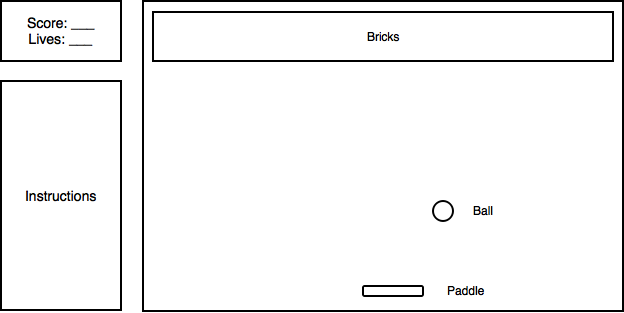

## Breaking Bricks

### Background

Breaking Bricks is a pong-style game inspired by the arcade classic, Breakout. The game begins with several layers of bricks placed in the top portion of the screen. A ball travels across the screen, bouncing off these bricks as well as the top and side walls of the playing field.

As a brick is hit, the ball bounces away and the brick is destroyed. If the ball reaches the bottom of the screen, the player loses a turn. To prevent this, the player controls a moving paddle to bounce the ball, keeping it in play.

### Functionality and MVP

Players of Breaking Bricks will be able to do the following:

- [ ] Start and pause the game
- [ ] Control a laterally-moving paddle to bounce the game ball
- [ ] Progress through multiple levels of gameplay
- [ ] Access game instructions on the sidebar
- [ ] View a production README

### Wireframes

Breaking Bricks will be featured on a single page. The main portion of the screen will represent the playing field, with gameplay instructions and controls illustrated to its immediate left.

### Technologies

Implementation of Breaking Bricks will be handled with the following technologies:

- Vanilla JavaScript for overall gameplay logic and structure
- HTML5 Canvas to render and manipulate the DOM
- Webpack to bundle all necessary modules

### Implementation Timeline

**Day 1**: Set up required Node modules, Webpack, etc. Create a basic file structure and overall skeleton of the app. A basic rendering of gameplay instructions, the playing field, and other details should be implemented.

**Day 2**: Become more familiar with Canvas to render necessary game graphics. The paddle and ball pieces should move, and bricks should disappear.

**Day 3**: Complete proper gameplay controls. Styling the front-end, implementing a pause feature, and polishing the overall user experience are key.

**Day 4**: Create additional levels and finish styling.
